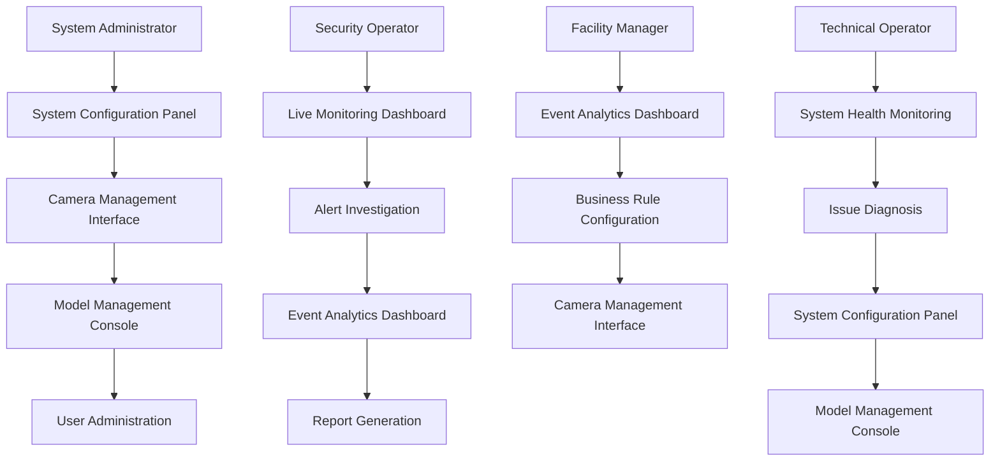

# Aries-Edge Platform Product Requirements Document

## 1. Product Overview

Aries-Edge Platform is an enterprise-grade multi-camera intelligent video analytics system that transforms traditional surveillance infrastructure into AI-powered real-time monitoring and alerting solutions. The platform processes multiple video streams simultaneously at the edge using hardware-accelerated deep learning, enabling real-time object detection, tracking, and behavioral analysis without cloud dependency.

The platform serves security operations teams, facility managers, and business intelligence professionals who need intelligent video analytics with sub-second response times, offline capability, and seamless cloud integration for centralized management and advanced analytics.

## 2. Core Features

### 2.1 User Roles

| Role | Registration Method | Core Permissions |
|------|---------------------|------------------|
| System Administrator | Manual creation by vendor | Full system access, user management, camera configuration, model deployment |
| Security Operator | Email invitation from admin | View real-time feeds, receive alerts, generate reports, manage detection zones |
| Facility Manager | Self-registration with approval | View analytics dashboards, configure business rules, access historical data |
| Technical Operator | LDAP/SSO integration | Monitor system health, configure cameras, update software, view logs |

### 2.2 Feature Module

The Aries-Edge Platform consists of the following main pages:

1. **Live Monitoring Dashboard**: Real-time multi-camera view with detection overlays, alert notifications, and system status indicators
2. **Camera Management Interface**: Camera configuration, stream management, detection zone setup, and health monitoring
3. **Event Analytics Dashboard**: Historical event analysis, trend visualization, custom report generation, and data export
4. **Model Management Console**: AI model deployment, performance monitoring, version control, and A/B testing
5. **System Configuration Panel**: Edge node management, network settings, user administration, and system-wide configuration

### 2.3 Page Details

| Page Name | Module Name | Feature description |
|-----------|-------------|---------------------|
| Live Monitoring Dashboard | Multi-camera Grid | Display up to 16 camera feeds simultaneously with 2-second latency, support drag-and-drop camera arrangement, auto-refresh every 500ms |
| Live Monitoring Dashboard | Detection Overlay | Render bounding boxes, confidence scores, and object classifications directly on video streams with customizable colors and labels |
| Live Monitoring Dashboard | Alert Panel | Show real-time alerts with severity levels, support audio notifications, enable quick acknowledgment and investigation workflow |
| Live Monitoring Dashboard | System Status | Display GPU utilization, memory usage, network bandwidth, and camera connectivity status with traffic light indicators |
| Camera Management Interface | Camera Discovery | Automatically detect and configure RTSP cameras on network, support manual URL input, validate stream connectivity |
| Camera Management Interface | Stream Configuration | Set resolution, frame rate, and codec parameters, configure multiple streams per camera for different use cases |
| Camera Management Interface | Detection Zones | Draw polygonal detection zones on camera view, set zone-specific detection rules and sensitivity parameters |
| Camera Management Interface | Health Monitoring | Monitor camera stream quality, detect offline cameras, track frame drops, generate health reports |
| Event Analytics Dashboard | Event Timeline | Display chronological event list with filtering by time, camera, event type, and confidence level, support infinite scroll |
| Event Analytics Dashboard | Data Visualization | Generate charts for event frequency, heat maps for activity patterns, trend analysis over custom time periods |
| Event Analytics Dashboard | Report Generation | Create custom reports with selected metrics, schedule automated report delivery, export data in CSV/JSON formats |
| Event Analytics Dashboard | Video Playback | Retrieve and playback recorded video segments associated with detection events, support frame-by-frame analysis |
| Model Management Console | Model Deployment | Upload and deploy new AI models to edge nodes, support rollback to previous versions, validate model compatibility |
| Model Management Console | Performance Metrics | Track model inference time, accuracy metrics, GPU utilization, compare performance across different model versions |
| Model Management Console | A/B Testing | Configure parallel model testing, split traffic between model versions, analyze comparative performance |
| Model Management Console | Active Learning | Review low-confidence detections, submit corrected annotations, trigger model retraining cycles |
| System Configuration Panel | Edge Node Management | Register new edge devices, monitor node health, configure load balancing, manage node-specific settings |
| System Configuration Panel | User Administration | Create and manage user accounts, assign roles and permissions, track user activity, configure authentication methods |
| System Configuration Panel | Network Configuration | Set up VPN connections, configure firewall rules, manage bandwidth allocation, monitor network performance |

## 3. Core Process

### 3.1 System Administrator Flow

The system administrator begins by accessing the System Configuration Panel to register edge nodes and configure the overall system architecture. They proceed to the Camera Management Interface to discover and configure cameras across the facility. Next, they deploy AI models through the Model Management Console, ensuring optimal model selection for each camera's use case. Finally, they set up user accounts and permissions through User Administration, completing the initial system setup.

### 3.2 Security Operator Flow

Security operators start their shift by accessing the Live Monitoring Dashboard to view real-time camera feeds and system status. When alerts appear in the Alert Panel, they acknowledge notifications and investigate events by reviewing detection overlays and accessing associated video playback. For significant incidents, they generate reports through the Event Analytics Dashboard and escalate to management as needed.

### 3.3 Facility Manager Flow

Facility managers access the Event Analytics Dashboard to review daily, weekly, and monthly activity reports. They analyze trend data to identify operational patterns and optimize facility usage. Based on insights, they may adjust detection zones and business rules in the Camera Management Interface to better align with operational requirements.

### 3.4 Technical Operator Flow

Technical operators monitor system health through the Live Monitoring Dashboard, watching for performance degradation or connectivity issues. When problems arise, they access detailed system logs and performance metrics to diagnose issues. They perform system updates, model deployments, and configuration changes through the System Configuration Panel and Model Management Console.

## 4. User Interface Design

### 4.1 Design Style

**Primary Colors**: Deep blue (#1E3A8A) for primary actions, bright green (#10B981) for success states, amber (#F59E0B) for warnings, red (#EF4444) for alerts and errors

**Secondary Colors**: Cool gray (#6B7280) for secondary text, light gray (#F3F4F6) for backgrounds, white (#FFFFFF) for cards and content areas

**Button Style**: Rounded corners with 8px radius, subtle shadows for depth, hover states with 10% darker shade, active states with 15% darker shade

**Typography**: Inter font family for UI elements, Roboto Mono for technical data, font sizes ranging from 12px for labels to 24px for headers

**Layout Style**: Card-based layout with 16px spacing grid, responsive grid system supporting 12-column layout, consistent 24px margins

**Icons**: Material Design icons for consistency, custom icons for domain-specific concepts, animated icons for loading and status indicators

### 4.2 Page Design Overview

| Page Name | Module Name | UI Elements |
|-----------|-------------|-------------|
| Live Monitoring Dashboard | Multi-camera Grid | 4x4 responsive grid layout, camera tiles with 16:9 aspect ratio, hover overlays showing camera name and status, drag-and-drop functionality with visual feedback |
| Live Monitoring Dashboard | Detection Overlay | Semi-transparent bounding boxes with color coding by object type, confidence percentages displayed as small badges, object class labels with consistent typography |
| Live Monitoring Dashboard | Alert Panel | Collapsible sidebar with alert severity indicators, timestamp display with relative time formatting, quick action buttons for acknowledgment and investigation |
| Camera Management Interface | Camera Discovery | Network scanning progress indicator, discovered camera list with thumbnail previews, manual configuration form with validation feedback |
| Camera Management Interface | Detection Zones | Interactive polygon drawing tool with vertex manipulation, zone-specific color coding, sensitivity sliders with real-time preview |
| Event Analytics Dashboard | Event Timeline | Infinite scroll implementation with smooth loading, multi-column layout with event thumbnails, advanced filtering panel with collapsible sections |
| Event Analytics Dashboard | Data Visualization | Interactive charts using Chart.js library, responsive design for mobile viewing, export functionality with format selection |
| Model Management Console | Model Deployment | Drag-and-drop model upload interface, deployment progress tracking with percentage completion, rollback controls with confirmation dialogs |
| Model Management Console | Performance Metrics | Real-time gauge charts for GPU utilization, line graphs for inference time trends, comparison tables with sortable columns |

### 4.3 Responsiveness

The platform implements a mobile-first responsive design approach with breakpoints at 640px, 768px, 1024px, and 1280px. The Live Monitoring Dashboard adapts from a 4x4 grid on desktop to a 2x2 grid on tablets and single camera view on mobile devices. Touch interactions are optimized with larger tap targets (minimum 44px), gesture support for camera navigation, and swipe gestures for alert dismissal. Performance is optimized for mobile networks with lazy loading of video streams, adaptive bitrate streaming, and offline capability with local storage of critical data.

## 5. Performance Requirements

### 5.1 Video Processing Performance
- Maximum latency: 2 seconds from capture to display
- Frame processing rate: 30 FPS per camera stream
- Detection accuracy: 95% for common object classes
- GPU utilization: Maximum 80% under full load
- Memory usage: Maximum 8GB per edge node

### 5.2 System Scalability
- Support up to 16 concurrent camera streams per edge node
- Handle 10,000 detection events per minute
- Store 90 days of event history with automatic archiving
- Support horizontal scaling to 100+ edge nodes
- Maintain sub-second response time for API requests

### 5.3 Reliability Requirements
- System availability: 99.9% uptime
- Automatic failover within 30 seconds
- Zero data loss during normal operations
- Graceful degradation under high load
- Self-healing capabilities for common failures

## 6. Security Requirements

### 6.1 Authentication and Authorization
- Multi-factor authentication support
- Role-based access control with granular permissions
- Session management with automatic timeout
- API key management for external integrations
- Audit logging for all user actions

### 6.2 Data Protection
- End-to-end encryption for video streams
- Encrypted storage for sensitive data
- Secure key management with rotation
- Network isolation with VPN support
- Regular security vulnerability assessments

### 6.3 Compliance
- GDPR compliance for data privacy
- SOC 2 Type II certification requirements
- ISO 27001 security standards
- Industry-specific compliance (HIPAA, PCI-DSS as applicable)
- Regular compliance auditing and reporting

## 7. Integration Requirements

### 7.1 Video Management Systems
- ONVIF protocol support for camera discovery
- RTSP/RTMP streaming protocol compatibility
- Integration with existing VMS platforms
- Support for various video codecs (H.264, H.265)
- Camera PTZ control integration

### 7.2 External Systems
- REST API for third-party integrations
- Webhook support for real-time notifications
- SIEM system integration for security events
- LDAP/Active Directory integration
- Cloud storage integration (AWS S3, Azure Blob)

### 7.3 Hardware Compatibility
- NVIDIA GPU support (Tesla T4, RTX series, Jetson)
- Intel CPU optimization with OpenVINO
- ARM processor support for edge devices
- Various camera manufacturer compatibility
- Network video recorder integration

## 8. Deployment Requirements

### 8.1 Edge Deployment
- Docker containerization for consistent deployment
- Kubernetes orchestration for scalability
- Air-gapped deployment capability
- Offline operation with periodic cloud sync
- Remote management and update capability

### 8.2 Cloud Integration
- Hybrid cloud-edge architecture
- Selective data synchronization
- Cloud-based model training and deployment
- Centralized management dashboard
- Disaster recovery with cloud backup

### 8.3 Maintenance and Updates
- Zero-downtime rolling updates
- Automated backup and restore procedures
- Health monitoring with proactive alerting
- Remote diagnostics and troubleshooting
- Version compatibility management

This comprehensive product requirements document provides the foundation for developing the Aries-Edge Platform with clear specifications for functionality, performance, security, and user