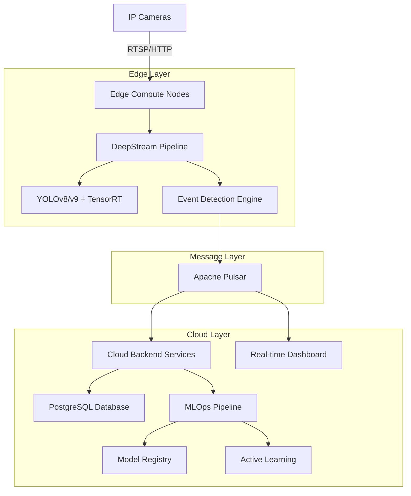
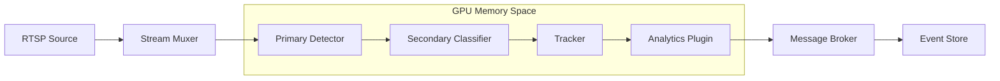

# Aries-Edge Platform Technical Architecture

## 1. System Architecture Overview

The Aries-Edge Platform is a sophisticated multi-camera intelligent video analytics system designed for edge deployment with hardware-accelerated processing capabilities. The architecture balances high-performance real-time video processing with cloud-native scalability and operational reliability.

### 1.1 High-Level Architecture



## 2. Edge Compute Architecture

### 2.1 DeepStream Pipeline Architecture

The core video processing pipeline leverages NVIDIA DeepStream SDK with custom GStreamer elements for optimal GPU utilization:



### 2.2 Custom YOLO TensorRT Implementation

#### 2.2.1 C++ Parser Implementation

```cpp
// Custom YOLO output tensor processor
class YoloTensorParser {
private:
    int num_classes;
    float conf_threshold;
    float nms_threshold;
    std::vector<float> anchors;
    
public:
    std::vector<Detection> parseTensor(
        float* gpu_tensor,
        int tensor_size,
        int frame_width,
        int frame_height,
        cudaStream_t stream
    ) {
        // Zero-copy GPU memory processing
        thrust::device_ptr<float> d_tensor(gpu_tensor);
        
        // Parallel confidence filtering
        auto conf_mask = thrust::make_transform_iterator(
            d_tensor,
            confidence_filter(conf_threshold)
        );
        
        // NMS implementation using Thrust
        thrust::sort_by_key(detections.begin(), detections.end(),
                           confidence_comparator());
        
        return applyNMS(detections, nms_threshold);
    }
};
```

#### 2.2.2 TensorRT Engine Optimization

```cpp
// TensorRT engine builder with dynamic batching
class TrtEngineBuilder {
public:
    ICudaEngine* buildEngine(
        const std::string& onnx_path,
        const DynamicDims& opt_profile,
        int max_batch_size = 30
    ) {
        auto builder = std::unique_ptr<IBuilder>(createInferBuilder(gLogger));
        auto config = std::unique_ptr<IBuilderConfig>(builder->createBuilderConfig());
        
        // Enable DLA for Jetson devices
        if (mDeviceType == DeviceType::kDLA) {
            config->setDefaultDeviceType(DeviceType::kDLA);
            config->setDLACore(0);
        }
        
        // Set optimization profile for dynamic batching
        auto profile = builder->createOptimizationProfile();
        profile->setDimensions("images", OptProfileSelector::kMIN, 
                              Dims4{1, 3, 640, 640});
        profile->setDimensions("images", OptProfileSelector::kOPT, 
                              Dims4{15, 3, 640, 640});
        profile->setDimensions("images", OptProfileSelector::kMAX, 
                              Dims4{30, 3, 640, 640});
        
        return builder->buildEngineWithConfig(*network, *config);
    }
};
```

### 2.3 Zero-Copy Memory Management

```cpp
// GPU memory pool for zero-copy operations
class GpuMemoryPool {
private:
    std::vector<void*> buffer_pool;
    std::queue<void*> available_buffers;
    std::mutex pool_mutex;
    
public:
    void* acquireBuffer(size_t size) {
        std::lock_guard<std::mutex> lock(pool_mutex);
        if (available_buffers.empty()) {
            void* new_buffer;
            cudaMalloc(&new_buffer, size);
            return new_buffer;
        }
        
        void* buffer = available_buffers.front();
        available_buffers.pop();
        return buffer;
    }
    
    void releaseBuffer(void* buffer) {
        std::lock_guard<std::mutex> lock(pool_mutex);
        available_buffers.push(buffer);
    }
};
```

## 3. Event-Driven Architecture

### 3.1 Apache Pulsar Integration

#### 3.1.1 Producer Configuration

```cpp
class PulsarEventProducer {
private:
    Client client;
    Producer producer;
    
public:
    void initialize(const std::string& broker_url) {
        ClientConfiguration config;
        config.setConnectionTimeout(30000);
        config.setOperationTimeout(30000);
        config.setIOThreads(4);
        config.setMessageListenerThreads(4);
        
        // Enable batching for high throughput
        ProducerConfiguration prod_config;
        prod_config.setBatchingEnabled(true);
        prod_config.setBatchingMaxMessages(1000);
        prod_config.setBatchingMaxPublishDelayMs(10);
        
        client.createProducer("persistent://public/default/detection-events", 
                             prod_config, producer);
    }
    
    void sendDetectionEvent(const DetectionEvent& event) {
        std::string event_json = serializeEvent(event);
        Message msg = MessageBuilder()
            .setContent(event_json)
            .setProperty("camera_id", event.camera_id)
            .setProperty("event_type", event.type)
            .setProperty("timestamp", std::to_string(event.timestamp))
            .build();
        
        Result result = producer.send(msg);
        if (result != ResultOk) {
            handleSendFailure(event, result);
        }
    }
};
```

#### 3.1.2 Consumer Implementation

```python
# Python consumer for cloud processing
import pulsar
from pulsar import ConsumerType, InitialPosition
import asyncio
import json

class DetectionEventConsumer:
    def __init__(self, broker_url: str, topic: str, subscription: str):
        self.client = pulsar.Client(
            broker_url,
            authentication=pulsar.AuthenticationToken(os.getenv('PULSAR_TOKEN')),
            operation_timeout_seconds=30,
            connection_timeout_ms=30000
        )
        
        self.consumer = self.client.subscribe(
            topic,
            subscription,
            consumer_type=ConsumerType.Shared,
            initial_position=InitialPosition.Latest,
            message_listener=self.process_message,
            receiver_queue_size=1000
        )
    
    async def process_message(self, consumer, message):
        try:
            event_data = json.loads(message.data())
            await self.handle_detection_event(event_data)
            consumer.acknowledge(message)
        except Exception as e:
            logger.error(f"Failed to process message: {e}")
            consumer.negative_acknowledge(message)
```

## 4. Backend Service Architecture

### 4.1 FastAPI Service Implementation

```python
# FastAPI backend with WebSocket support
from fastapi import FastAPI, WebSocket, WebSocketDisconnect, Depends
from fastapi.middleware.cors import CORSMiddleware
import asyncio
import redis.asyncio as redis
from typing import List, Dict
import json

class ConnectionManager:
    def __init__(self):
        self.active_connections: Dict[str, List[WebSocket]] = {}
        self.redis_client = redis.Redis(host='localhost', port=6379, db=0)
    
    async def connect(self, websocket: WebSocket, client_id: str):
        await websocket.accept()
        if client_id not in self.active_connections:
            self.active_connections[client_id] = []
        self.active_connections[client_id].append(websocket)
        
        # Subscribe to Redis channels for this client
        await self.subscribe_to_events(client_id)
    
    async def subscribe_to_events(self, client_id: str):
        pubsub = self.redis_client.pubsub()
        await pubsub.subscribe(f"camera_events:{client_id}")
        
        async for message in pubsub.listen():
            if message['type'] == 'message':
                event_data = json.loads(message['data'])
                await self.broadcast_to_client(client_id, event_data)

app = FastAPI(title="Aries-Edge Analytics API")

app.add_middleware(
    CORSMiddleware,
    allow_origins=["*"],
    allow_credentials=True,
    allow_methods=["*"],
    allow_headers=["*"],
)

manager = ConnectionManager()

@app.websocket("/ws/{client_id}")
async def websocket_endpoint(websocket: WebSocket, client_id: str):
    await manager.connect(websocket, client_id)
    try:
        while True:
            # Keep connection alive and handle ping/pong
            data = await websocket.receive_text()
            await websocket.send_text(f"pong: {data}")
    except WebSocketDisconnect:
        manager.disconnect(websocket, client_id)
```

### 4.2 WebSocket Authentication

```python
# JWT-based WebSocket authentication
from jose import JWTError, jwt
from fastapi import HTTPException, status

class WebSocketAuth:
    def __init__(self, secret_key: str, algorithm: str = "HS256"):
        self.secret_key = secret_key
        self.algorithm = algorithm
    
    async def authenticate_websocket(self, websocket: WebSocket) -> dict:
        token = websocket.headers.get("Authorization", "").replace("Bearer ", "")
        
        try:
            payload = jwt.decode(token, self.secret_key, algorithms=[self.algorithm])
            username: str = payload.get("sub")
            if username is None:
                raise HTTPException(
                    status_code=status.HTTP_401_UNAUTHORIZED,
                    detail="Invalid authentication credentials"
                )
            return payload
        except JWTError:
            raise HTTPException(
                status_code=status.HTTP_401_UNAUTHORIZED,
                detail="Invalid authentication credentials"
            )
```

## 5. Database Schema Design

### 5.1 PostgreSQL Schema

```sql
-- Camera configuration table
CREATE TABLE cameras (
    id UUID PRIMARY KEY DEFAULT gen_random_uuid(),
    camera_id VARCHAR(50) UNIQUE NOT NULL,
    name VARCHAR(255) NOT NULL,
    rtsp_url TEXT NOT NULL,
    location POINT,
    resolution VARCHAR(20) DEFAULT '1920x1080',
    fps INTEGER DEFAULT 30,
    is_active BOOLEAN DEFAULT true,
    config JSONB DEFAULT '{}',
    created_at TIMESTAMP WITH TIME ZONE DEFAULT NOW(),
    updated_at TIMESTAMP WITH TIME ZONE DEFAULT NOW()
);

-- Detection events table with partitioning
CREATE TABLE detection_events (
    id UUID PRIMARY KEY DEFAULT gen_random_uuid(),
    camera_id UUID REFERENCES cameras(id),
    event_type VARCHAR(50) NOT NULL,
    confidence FLOAT NOT NULL,
    bbox_x INTEGER,
    bbox_y INTEGER,
    bbox_width INTEGER,
    bbox_height INTEGER,
    metadata JSONB DEFAULT '{}',
    frame_timestamp BIGINT NOT NULL,
    processed_at TIMESTAMP WITH TIME ZONE DEFAULT NOW()
) PARTITION BY RANGE (processed_at);

-- Create monthly partitions
CREATE TABLE detection_events_2024_01 PARTITION OF detection_events
    FOR VALUES FROM ('2024-01-01') TO ('2024-02-01');

-- Indexes for performance
CREATE INDEX idx_detection_events_camera_timestamp 
    ON detection_events(camera_id, frame_timestamp DESC);
CREATE INDEX idx_detection_events_type_timestamp 
    ON detection_events(event_type, processed_at DESC);
CREATE INDEX GIN idx_detection_events_metadata 
    ON detection_events USING GIN(metadata);

-- Model performance metrics table
CREATE TABLE model_metrics (
    id UUID PRIMARY KEY DEFAULT gen_random_uuid(),
    model_name VARCHAR(100) NOT NULL,
    model_version VARCHAR(20) NOT NULL,
    inference_time_ms FLOAT NOT NULL,
    gpu_utilization FLOAT,
    memory_usage_mb INTEGER,
    detection_count INTEGER DEFAULT 0,
    error_count INTEGER DEFAULT 0,
    timestamp TIMESTAMP WITH TIME ZONE DEFAULT NOW()
);

-- Active learning samples
CREATE TABLE learning_samples (
    id UUID PRIMARY KEY DEFAULT gen_random_uuid(),
    camera_id UUID REFERENCES cameras(id),
    frame_path TEXT NOT NULL,
    annotation_data JSONB,
    uncertainty_score FLOAT,
    sample_type VARCHAR(20) DEFAULT 'uncertainty',
    is_labeled BOOLEAN DEFAULT false,
    created_at TIMESTAMP WITH TIME ZONE DEFAULT NOW()
);
```

## 6. Frontend Real-time Architecture

### 6.1 React Real-time Dashboard

```typescript
// React component with WebSocket integration
import React, { useState, useEffect, useRef } from 'react';
import { useWebSocket } from 'react-use-websocket';

interface DetectionEvent {
  id: string;
  camera_id: string;
  event_type: string;
  confidence: number;
  bbox: {
    x: number;
    y: number;
    width: number;
    height: number;
  };
  timestamp: number;
}

const RealtimeDashboard: React.FC = () => {
  const [events, setEvents] = useState<DetectionEvent[]>([]);
  const [connectionStatus, setConnectionStatus] = useState<'connecting' | 'connected' | 'disconnected'>('connecting');
  const eventBuffer = useRef<DetectionEvent[]>([]);
  
  const { sendMessage, lastMessage, readyState } = useWebSocket(
    `${WS_URL}/ws/dashboard`,
    {
      onOpen: () => setConnectionStatus('connected'),
      onClose: () => setConnectionStatus('disconnected'),
      onMessage: (event) => {
        const detectionEvent: DetectionEvent = JSON.parse(event.data);
        eventBuffer.current.push(detectionEvent);
      },
      shouldReconnect: () => true,
      reconnectInterval: 3000,
    }
  );
  
  // Batch processing for performance
  useEffect(() => {
    const interval = setInterval(() => {
      if (eventBuffer.current.length > 0) {
        setEvents(prev => [...eventBuffer.current, ...prev].slice(0, 1000));
        eventBuffer.current = [];
      }
    }, 100);
    
    return () => clearInterval(interval);
  }, []);
  
  return (
    <div className="realtime-dashboard">
      <ConnectionIndicator status={connectionStatus} />
      <EventGrid events={events} />
      <CameraGrid events={events} />
    </div>
  );
};
```

### 6.2 Performance Optimization

```typescript
// Virtual scrolling for large event lists
import { FixedSizeList } from 'react-window';
import { memo } from 'react';

const EventList = memo(({ events }: { events: DetectionEvent[] }) => {
  const Row = ({ index, style }: { index: number; style: React.CSSProperties }) => (
    <div style={style}>
      <EventCard event={events[index]} />
    </div>
  );
  
  return (
    <FixedSizeList
      height={800}
      itemCount={events.length}
      itemSize={120}
      width="100%"
    >
      {Row}
    </FixedSizeList>
  );
});
```

## 7. MLOps Pipeline Architecture

### 7.1 Active Learning Implementation

```python
# Uncertainty-based sample selection
import torch
import numpy as np
from sklearn.cluster import KMeans

class ActiveLearningSampler:
    def __init__(self, model, uncertainty_threshold=0.3, diversity_weight=0.5):
        self.model = model
        self.uncertainty_threshold = uncertainty_threshold
        self.diversity_weight = diversity_weight
    
    def select_samples(self, unlabeled_pool, n_samples=100):
        # Calculate uncertainty scores
        uncertainty_scores = self.calculate_uncertainty(unlabeled_pool)
        
        # Calculate diversity scores using feature clustering
        features = self.extract_features(unlabeled_pool)
        diversity_scores = self.calculate_diversity(features)
        
        # Combined score
        combined_scores = (1 - self.diversity_weight) * uncertainty_scores + \
                         self.diversity_weight * diversity_scores
        
        # Select top samples
        selected_indices = np.argsort(combined_scores)[-n_samples:]
        return selected_indices
    
    def calculate_uncertainty(self, samples):
        with torch.no_grad():
            predictions = self.model(samples)
            # Use entropy as uncertainty measure
            entropy = -torch.sum(predictions * torch.log(predictions + 1e-8), dim=1)
            return entropy.cpu().numpy()
```

### 7.2 Federated Learning Setup

```python
# Federated learning coordinator
import torch
import torch.distributed as dist
from torch.nn.parallel import DistributedDataParallel as DDP

class FederatedLearningCoordinator:
    def __init__(self, n_clients, model_architecture):
        self.n_clients = n_clients
        self.global_model = model_architecture()
        self.client_models = {}
        self.client_data_sizes = {}
    
    def federated_averaging(self, client_updates):
        """Aggregate model updates using FedAvg algorithm"""
        global_dict = self.global_model.state_dict()
        
        for key in global_dict.keys():
            global_dict[key] = torch.stack([
                client_updates[client_id][key] * self.client_data_sizes[client_id]
                for client_id in client_updates.keys()
            ]).sum(dim=0) / sum(self.client_data_sizes.values())
        
        self.global_model.load_state_dict(global_dict)
        return self.global_model
    
    def distribute_model(self, client_id):
        """Distribute global model to edge devices"""
        return copy.deepcopy(self.global_model)
```

## 8. Docker Containerization Strategy

### 8.1 Multi-stage Edge Container

```dockerfile
# Multi-stage build for edge deployment
FROM nvcr.io/nvidia/deepstream:6.4-triton-multiarch AS deepstream-base

# Install dependencies
RUN apt-get update && apt-get install -y \
    python3-pip \
    python3-dev \
    build-essential \
    cmake \
    git \
    && rm -rf /var/lib/apt/lists/*

# Build TensorRT engines
FROM deepstream-base AS tensorrt-builder
COPY models/yolov8.onnx /tmp/
RUN /usr/src/tensorrt/bin/trtexec \
    --onnx=/tmp/yolov8.onnx \
    --saveEngine=/opt/models/yolov8.engine \
    --workspace=4096 \
    --fp16 \
    --explicitBatch \
    --minShapes=images:1x3x640x640 \
    --optShapes=images:15x3x640x640 \
    --maxShapes=images:30x3x640x640

# Final runtime container
FROM deepstream-base
COPY --from=tensorrt-builder /opt/models/ /opt/models/

# Install Python dependencies
COPY requirements.txt /tmp/
RUN pip3 install --no-cache-dir -r /tmp/requirements.txt

# Copy application code
COPY src/ /opt/aries-edge/
WORKDIR /opt/aries-edge

# Create non-root user
RUN useradd -m -u 1000 aries && chown -R aries:aries /opt/aries-edge
USER aries

# Health check
HEALTHCHECK --interval=30s --timeout=10s --start-period=5s --retries=3 \
    CMD python3 -c "import requests; requests.get('http://localhost:8080/health')"

ENTRYPOINT ["python3", "main.py"]
```

### 8.2 Docker Compose for Edge Deployment

```yaml
version: '3.8'

services:
  deepstream-edge:
    build:
      context: .
      dockerfile: Dockerfile.edge
    runtime: nvidia
    environment:
      - NVIDIA_VISIBLE_DEVICES=all
      - NVIDIA_DRIVER_CAPABILITIES=video,compute,utility
      - DISPLAY=$DISPLAY
    volumes:
      - /tmp/.X11-unix:/tmp/.X11-unix:rw
      - ./config:/opt/config
      - ./models:/opt/models
      - ./logs:/opt/logs
    ports:
      - "8080:8080"
      - "9092:9092"
    networks:
      - edge-network
    restart: unless-stopped
    deploy:
      resources:
        reservations:
          devices:
            - driver: nvidia
              count: 1
              capabilities: [gpu]

  pulsar-edge:
    image: apachepulsar/pulsar:3.0.0
    command: bin/pulsar standalone
    ports:
      - "6650:6650"
      - "8081:8080"
    volumes:
      - pulsar-data:/pulsar/data
    networks:
      - edge-network
    restart: unless-stopped

  redis-edge:
    image: redis:7-alpine
    ports:
      - "6379:6379"
    volumes:
      - redis-data:/data
    networks:
      - edge-network
    restart: unless-stopped

volumes:
  pulsar-data:
  redis-data:

networks:
  edge-network:
    driver: bridge
```

## 9. Production Deployment Framework

### 9.1 Kubernetes Deployment

```yaml
# Edge node deployment with GPU support
apiVersion: apps/v1
kind: DaemonSet
metadata:
  name: aries-edge-node
  namespace: aries-edge
spec:
  selector:
    matchLabels:
      app: aries-edge-node
  template:
    metadata:
      labels:
        app: aries-edge-node
    spec:
      nodeSelector:
        accelerator: nvidia-tesla-t4
      containers:
      - name: deepstream-edge
        image: aries-edge/deepstream:latest
        resources:
          requests:
            nvidia.com/gpu: 1
            memory: "4Gi"
            cpu: "2"
          limits:
            nvidia.com/gpu: 1
            memory: "8Gi"
            cpu: "4"
        env:
        - name: NVIDIA_VISIBLE_DEVICES
          value: "all"
        - name: NVIDIA_DRIVER_CAPABILITIES
          value: "video,compute,utility"
        volumeMounts:
        - name: config
          mountPath: /opt/config
        - name: models
          mountPath: /opt/models
        livenessProbe:
          httpGet:
            path: /health
            port: 8080
          initialDelaySeconds: 30
          periodSeconds: 10
        readinessProbe:
          httpGet:
            path: /ready
            port: 8080
          initialDelaySeconds: 10
          periodSeconds: 5
      volumes:
      - name: config
        configMap:
          name: aries-edge-config
      - name: models
        persistentVolumeClaim:
          claimName: aries-models-pvc
```

### 9.2 Monitoring and Observability

```yaml
# Prometheus monitoring configuration
apiVersion: v1
kind: ServiceMonitor
metadata:
  name: aries-edge-monitor
  namespace: monitoring
spec:
  selector:
    matchLabels:
      app: aries-edge-node
  endpoints:
  - port: metrics
    interval: 15s
    path: /metrics
```

## 10. Critical Failure Points and Solutions

### 10.1 Performance Scalability Solutions

#### Problem: GPU Memory Exhaustion
**Solution**: Implement dynamic batch sizing with memory monitoring

```cpp
class DynamicBatchSizer {
private:
    size_t max_gpu_memory;
    size_t current_memory_usage;
    std::mutex memory_mutex;
    
public:
    int calculateOptimalBatchSize(int requested_batch) {
        std::lock_guard<std::mutex> lock(memory_mutex);
        
        size_t available_memory = max_gpu_memory - current_memory_usage;
        size_t memory_per_frame = estimateMemoryPerFrame();
        
        int max_possible = available_memory / memory_per_frame;
        return std::min(requested_batch, max_possible);
    }
    
    void updateMemoryUsage(size_t delta) {
        std::lock_guard<std::mutex> lock(memory_mutex);
        current_memory_usage += delta;
    }
};
```

#### Problem: Message Queue Backpressure
**Solution**: Implement circuit breaker pattern with adaptive batching

```python
class AdaptiveMessageBatcher:
    def __init__(self, pulsar_producer, initial_batch_size=100):
        self.producer = pulsar_producer
        self.batch_size = initial_batch_size
        self.message_queue = asyncio.Queue(maxsize=10000)
        self.circuit_breaker = CircuitBreaker(failure_threshold=5)
    
    async def adaptive_batch_send(self):
        while True:
            batch = []
            deadline = asyncio.get_event_loop().time() + 0.1  # 100ms deadline
            
            while len(batch) < self.batch_size and asyncio.get_event_loop().time() < deadline:
                try:
                    message = await asyncio.wait_for(
                        self.message_queue.get(), 
                        timeout=0.01
                    )
                    batch.append(message)
                except asyncio.TimeoutError:
                    break
            
            if batch:
                success = await self.circuit_breaker.call(
                    self.send_batch, batch
                )
                
                # Adjust batch size based on success/failure
                if success:
                    self.batch_size = min(self.batch_size * 1.1, 1000)
                else:
                    self.batch_size = max(self.batch_size * 0.5, 10)
```

### 10.2 Reliability and Coupling Mitigation

#### Problem: Tight Coupling Between Components
**Solution**: Implement event-driven architecture with message versioning

```python
# Versioned event schema
from pydantic import BaseModel, Field
from typing import Optional, Dict, Any

class DetectionEventV1(BaseModel):
    version: str = "1.0"
    event_id: str
    camera_id: str
    timestamp: int
    detections: list
    
class DetectionEventV2(BaseModel):
    version: str = "2.0"
    event_id: str
    camera_id: str
    timestamp: int
    detections: list
    metadata: Optional[Dict[str, Any]] = None
    
class EventCompatibilityLayer:
    @staticmethod
    def convert_v2_to_v1(v2_event: DetectionEventV2) -> DetectionEventV1:
        return DetectionEventV1(
            event_id=v2_event.event_id,
            camera_id=v2_event.camera_id,
            timestamp=v2_event.timestamp,
            detections=v2_event.detections
        )
```

### 10.3 Configuration Management

#### Problem: Static Configuration Limitations
**Solution**: Implement dynamic configuration with feature flags

```python
# Dynamic configuration with etcd
import etcd3
import json
import threading

class DynamicConfiguration:
    def __init__(self, etcd_host='localhost', etcd_port=2379):
        self.etcd = etcd3.client(host=etcd_host, port=etcd_port)
        self.config_cache = {}
        self.watch_threads = {}
        
    def get_config(self, key: str, default=None):
        if key not in self.config_cache:
            value, _ = self.etcd.get(f"/aries-edge/config/{key}")
            if value:
                self.config_cache[key] = json.loads(value)
            else:
                self.config_cache[key] = default
                
        return self.config_cache[key]
    
    def watch_config(self, key: str, callback):
        def watch_changes():
            events_iterator, cancel = self.etcd.watch(f"/aries-edge/config/{key}")
            for event in events_iterator:
                if isinstance(event, etcd3.events.PutEvent):
                    new_value = json.loads(event.value)
                    self.config_cache[key] = new_value
                    callback(key, new_value)
        
        thread = threading.Thread(target=watch_changes)
        thread.daemon = True
        thread.start()
        self.watch_threads[key] = thread
```

## 11. API Specifications

### 11.1 REST API Endpoints

| Endpoint | Method | Description | Request Body | Response |
|----------|---------|-------------|--------------|----------|
| /api/v1/cameras | GET | List all cameras | - | `{cameras: Camera[]}` |
| /api/v1/cameras | POST | Add new camera | `{rtsp_url: string, name: string}` | `{camera: Camera}` |
| /api/v1/cameras/{id} | GET | Get camera details | - | `{camera: Camera}` |
| /api/v1/cameras/{id} | PUT | Update camera | `{name?: string, config?: object}` | `{camera: Camera}` |
| /api/v1/events | GET | Query detection events | Query params: `{camera_id?, type?, start_time?, end_time?, limit?}` | `{events: Event[], total: number}` |
| /api/v1/events/{id} | GET | Get event details | - | `{event: Event}` |
| /api/v1/models | GET | List available models | - | `{models: Model[]}` |
| /api/v1/models/{id}/deploy | POST | Deploy model to edge | `{target_nodes: string[]}` | `{deployment: Deployment}` |
| /api/v1/metrics | GET | System metrics | Query params: `{metric_type?, time_range?}` | `{metrics: Metric[]}` |

### 11.2 WebSocket Events

```typescript
interface WebSocketMessage {
  type: 'event' | 'system' | 'error';
  timestamp: number;
  data: any;
}

interface DetectionEventMessage extends WebSocketMessage {
  type: 'event';
  data: {
    event_type: 'detection' | 'alert' | 'system';
    camera_id: string;
    detections: Detection[];
    frame_url?: string;
    metadata?: Record<string, any>;
  };
}

interface SystemStatusMessage extends WebSocketMessage {
  type: 'system';
  data: {
    status: 'connected' | 'disconnected' | 'error';
    node_id: string;
    metrics?: SystemMetrics;
  };
}
```

## 12. Implementation Roadmap

### Phase 1: Core Video Processing (Weeks 1-4)
- [ ] DeepStream pipeline setup with basic YOLO integration
- [ ] RTSP camera connectivity and stream management
- [ ] Basic detection event generation and storage
- [ ] Docker containerization for edge deployment

### Phase 2: Event Architecture (Weeks 5-8)
- [ ] Apache Pulsar integration and message routing
- [ ] WebSocket real-time dashboard
- [ ] Backend API development with FastAPI
- [ ] PostgreSQL database setup and optimization

### Phase 3: Advanced Analytics (Weeks 9-12)
- [ ] Multi-camera tracking and correlation
- [ ] Advanced YOLO models with TensorRT optimization
- [ ] Dynamic configuration management
- [ ] Performance monitoring and alerting

### Phase 4: MLOps Integration (Weeks 13-16)
- [ ] Active learning pipeline implementation
- [ ] Model versioning and deployment system
- [ ] Federated learning coordinator
- [ ] A/B testing framework for model comparison

### Phase 5: Production Hardening (Weeks 17-20)
- [ ] Kubernetes deployment automation
- [ ] Comprehensive monitoring and observability
- [ ] Security hardening and authentication
- [ ] Performance optimization and scaling

This technical architecture provides a comprehensive foundation for implementing the Aries-Edge Platform with production-ready specifications, failure-resistant design patterns, and scalable architecture principles.